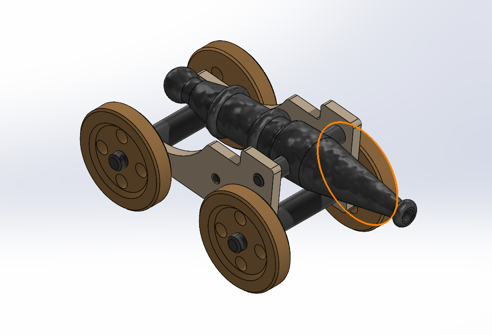
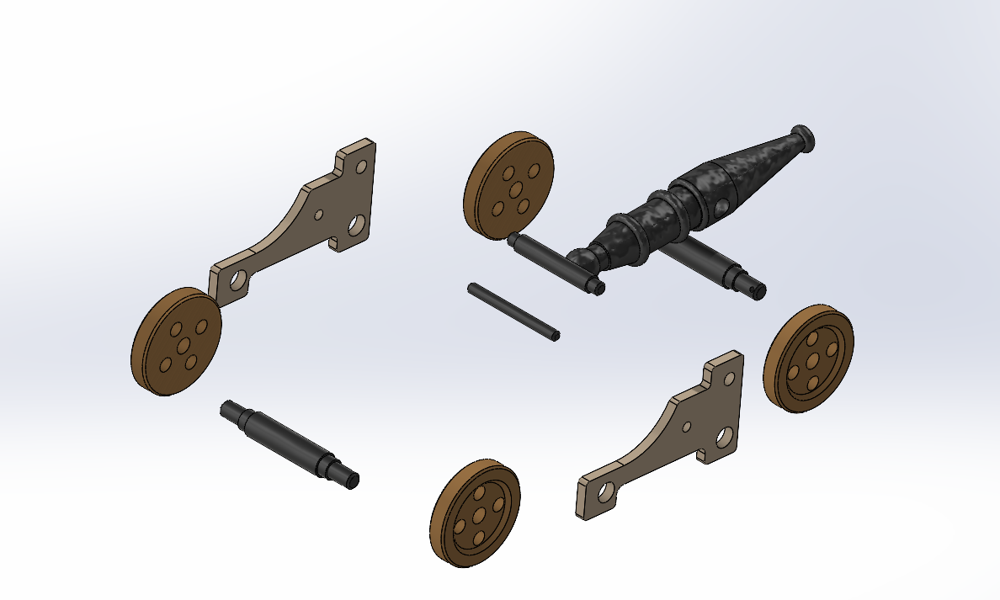
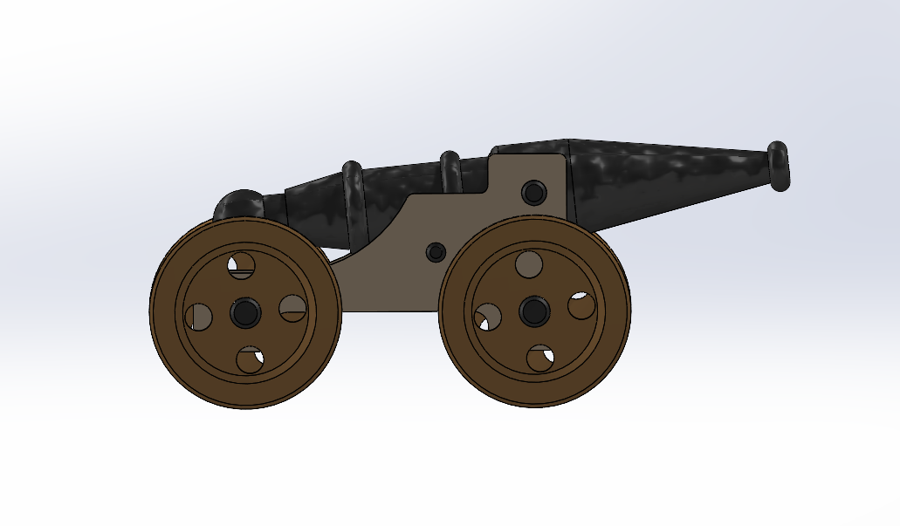
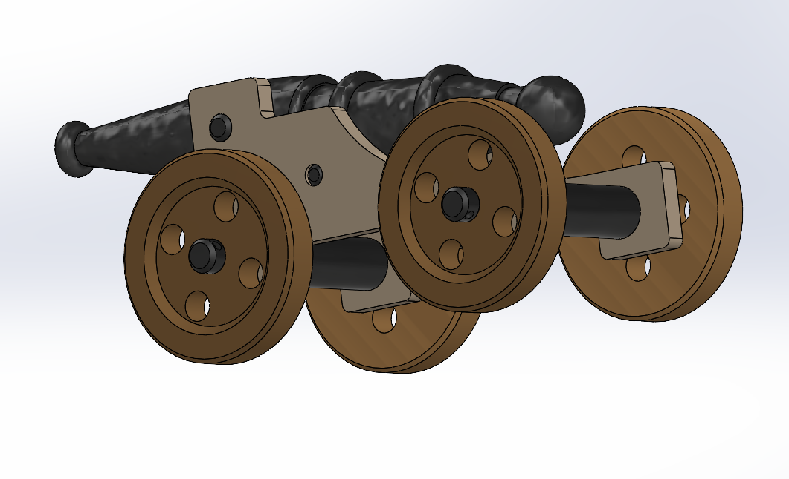

# classic-cannon-solidworks
Classic cannon assembly modeled and assembled in SOLIDWORKS for CAD practice.
## Overview

This project is a 3D CAD model of a classic cannon developed in **SOLIDWORKS** as part of my CAD learning journey. The project involved modeling individual components and assembling them to gain hands-on experience with mechanical assembly workflows and strengthen my understanding of mechanical CAD design.

---

## Project Preview

### Isometric View

### Exploded View

### Side View

### Rear Perspective

---

## Skills Demonstrated

- Part Modeling
- Assembly Design
- Assembly Mates
- Exploded View Creation
- Mechanical CAD Workflow

---

## Software Used

- SOLIDWORKS

---

## Repository Contents

- `Cannon.SLDASM` – Assembly file
- `.SLDPRT` files – Individual part files
- Project preview images

---

## Author

**Barun Gautam**  
Mechanical Engineering Student
